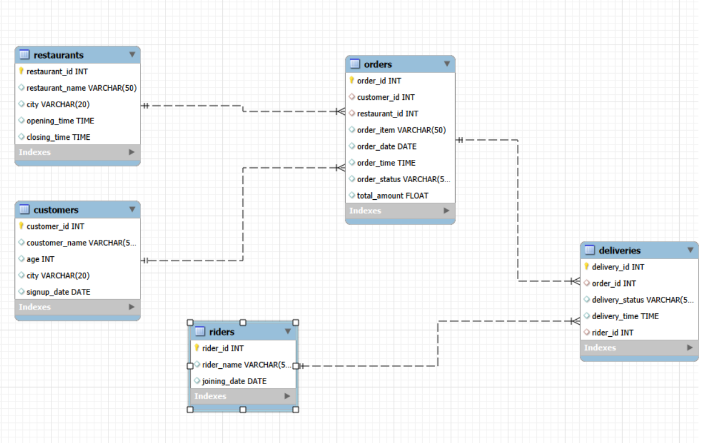

# 🍽️ Zomato Food Delivery SQL Analysis

## 📌 Project Overview

This project presents an end-to-end SQL analysis of a simulated Zomato-style food delivery database. Using MySQL, I explored customer behaviour, restaurant performance, delivery operations, and revenue trends to answer practical business questions through structured data analysis.

The project demonstrates relational database design, SQL querying, and business-oriented analytics using a realistic food delivery dataset.

---

## 🎯 Objectives

- Analyze customer ordering patterns
- Evaluate restaurant performance
- Measure delivery efficiency
- Identify revenue trends
- Practice writing optimized SQL queries
- Strengthen relational database concepts

---

## 🗂️ Database Schema

The database consists of five interconnected tables:

- Customers
- Restaurants
- Orders
- Deliveries
- Riders

### Entity Relationship Diagram



---

## 📊 Business Questions Solved

Some of the analyses include:

- Top-performing restaurants by revenue
- Customers with the highest spending
- Restaurants receiving the most orders
- Order status distribution
- Delivery performance analysis
- Average order value
- Customer acquisition trends
- Daily order trends
- Restaurants without orders
- Customers who never placed an order

---

## 🛠️ Technologies Used

- MySQL
- MySQL Workbench
- SQL
- Git
- GitHub

---

## 📁 Repository Structure

```
zomato-food-delivery-sql-analysis
│
├── SQL.zomato.analysis.sql
├── zomato-er-diagram.png
└── README.md
```

---

## 📚 SQL Concepts Applied

- SELECT
- WHERE
- GROUP BY
- HAVING
- ORDER BY
- Aggregate Functions
- INNER JOIN
- LEFT JOIN
- Subqueries
- CASE Statements
- Date Functions

---

## 🚀 Future Improvements

- Window Functions
- Common Table Expressions (CTEs)
- Stored Procedures
- Performance Optimization
- Power BI Dashboard
- Python Data Analysis

---

## 👨‍💻 Author

**Ahan Rai**

Business Intelligence & Analytics Student

**Interests**

- Data Analytics
- Business Intelligence
- SQL
- Python
- Artificial Intelligence

---

⭐ If you found this project interesting, consider giving it a star.
